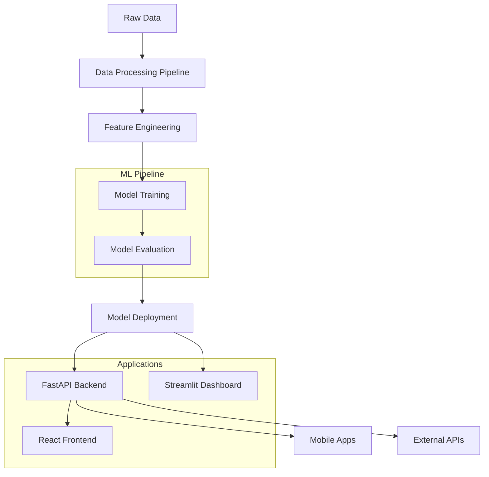

# Sri Lanka Tourism Arrival Forecasting Model

<div align="center">


**AI-Powered Tourism Arrival Predictions & Analytics Platform**

*Predict monthly tourist arrivals to Sri Lanka with machine learning models, interactive dashboards, and comprehensive deployment options.*

</div>

## Project Overview

This comprehensive machine learning project provides accurate forecasting of monthly tourist arrivals to Sri Lanka using advanced time series modeling. The system offers both total arrival predictions and country-specific forecasts through multiple user interfaces.

### Key Features

- **Advanced ML Models**: CatBoost regressors with time series features
- **Country-Specific Forecasts**: Predictions for individual source countries
- **Modern Web Interface**: React-based frontend with real-time visualizations
- **REST API**: FastAPI backend with comprehensive endpoints
- **Interactive Dashboard**: Streamlit app for data exploration
- **Containerized Deployment**: Docker support with multiple deployment options
- **Model Explainability**: SHAP values and feature importance analysis

## Architecture



## Project Structure

```
tourism-forecast-ml/
├── data/                    # Datasets and processed features
├── notebooks/               # Jupyter analysis notebooks
├── src/                     # Core ML and API code
├── frontend/                # React web application  
├── outputs/                 # Trained models and metrics
├── Dockerfile.*            # Container configurations
├── docker-compose.yml      # Multi-service orchestration
├── requirements.txt        # Python dependencies
├── streamlit_app.py        # Interactive dashboard
└── start-*.{ps1,bat}      # Quick start scripts
```

## Technology Stack

### Backend & ML
- **Python 3.9+** - Core language
- **CatBoost** - Gradient boosting models
- **FastAPI** - Modern web framework
- **Pandas/NumPy** - Data manipulation
- **Scikit-learn** - ML utilities
- **SHAP** - Model explainability
- **Plotly** - Interactive visualizations

### Frontend
- **React 19** - UI framework
- **TypeScript** - Type safety
- **Tailwind CSS** - Styling framework
- **Framer Motion** - Animations
- **Recharts** - Chart library
- **Vite** - Build tool
- **Axios** - HTTP client

### DevOps & Deployment
- **Docker** - Containerization
- **Railway** - Cloud deployment
- **Render** - Alternative deployment
- **Nginx** - Reverse proxy
- **PowerShell/Bash** - Automation scripts

## Quick Start

### Option 1: Docker Deployment (Recommended)

```bash
# Clone the repository
git clone <your-repo-url>
cd tourism-forecast-ml

# Windows PowerShell
.\start-docker.ps1

# Windows Command Prompt
start-docker.bat

# Linux/macOS
docker-compose up --build -d
```

**Access Points:**
- **Web App**: http://localhost:80
- **API**: http://localhost:8000
- **Dashboard**: http://localhost:8501

### Option 2: Local Development

#### Backend Setup
```bash
# Install Python dependencies
pip install -r requirements.txt

# Start FastAPI server
uvicorn src.app:app --reload --port 8000
```

#### Frontend Setup
```bash
# Navigate to frontend directory
cd frontend

# Install Node.js dependencies
npm install

# Start development server
npm run dev
```

#### Streamlit Dashboard
```bash
# Start Streamlit app
streamlit run streamlit_app.py --server.port 8501
```

### Option 3: Cloud Deployment

#### Railway Deployment
```bash
railway up
```

#### Render Deployment
See [render.yaml](render.yaml) for configuration

##  Dataset Information

### Data Sources
- **Period**: 2019-2025 monthly data
- **Total Arrivals**: Aggregate tourist arrivals to Sri Lanka
- **Country-Specific**: Arrivals from major source countries
- **Features**: Time-based, lag features, rolling statistics

### Key Datasets
- `data/total_features.csv` - Aggregated arrival data with engineered features
- `data/country_features.csv` - Country-specific arrival data
- `data/cleaned.csv` - Raw cleaned tourism data
- `data/processed.csv` - Intermediate processed data

## Machine Learning Pipeline

### Models
1. **Total Arrivals Model**: Predicts overall monthly arrivals
2. **Country-Specific Model**: Forecasts arrivals from individual countries

### eature Engineering
- **Temporal Features**: Year, month, cyclical encoding
- **Lag Features**: Previous month(s) arrivals
- **Rolling Statistics**: 3-month moving averages
- **Seasonal Patterns**: Sine/cosine month encoding

### Model Performance
- **Primary Metric**: MAPE (Mean Absolute Percentage Error)
- **Secondary Metrics**: MAE, RMSE
- **Cross-Validation**: Time series split validation
- **Explainability**: SHAP feature importance

### Training Process
```bash
# Train total arrivals model
python src/train.py

# Train country-specific model
python src/train_country.py
```

## API Reference

### Base URL: `http://localhost:8000/api`

#### Endpoints

##### Health Check
```http
GET /api/health
```

##### Single Prediction
```http
POST /api/predict
Content-Type: application/json

{
    "year": 2026,
    "month": 3
}
```

##### Multi-Period Forecast
```http
POST /api/forecast
Content-Type: application/json

{
    "start_year": 2026,
    "start_month": 3,
    "horizon": 6
}
```

##### Available Countries
```http
GET /api/countries
```

##### Country-Specific Forecast
```http
POST /api/forecast_country
Content-Type: application/json

{
    "country": "AUSTRALIA",
    "start_year": 2026,
    "start_month": 3,
    "horizon": 6
}
```

## Jupyter Notebooks

Explore the complete data science workflow:

1. **[01_data_cleaning.ipynb](notebooks/01_data_cleaning.ipynb)** - Data preprocessing and cleaning
2. **[02_feature_engineering.ipynb](notebooks/02_feature_engineering.ipynb)** - Feature creation and selection
3. **[03_training_evaluation.ipynb](notebooks/03_training_evaluation.ipynb)** - Model training and validation
4. **[04_explainability.ipynb](notebooks/04_explainability.ipynb)** - SHAP analysis and interpretability

##  Frontend Features

### User Interface
- **Responsive Design**: Mobile-first approach
- **Real-time Charts**: Interactive forecast visualizations
- **Country Selection**: Dropdown for country-specific forecasts
- **Date Pickers**: Intuitive date selection
- **Export Options**: Download forecasts as CSV/PNG

### Animations
- **Smooth Transitions**: Framer Motion animations
- **Loading States**: Skeleton screens and spinners
- **Chart Animations**: Animated chart transitions
- **Micro-interactions**: Button hover effects

## Model Explainability

### SHAP Analysis
- **Feature Importance**: Global feature rankings
- **Individual Predictions**: SHAP value breakdowns
- **Partial Dependence**: Feature effect visualizations
- **Interaction Effects**: Feature interaction analysis

### Interpretability Features
- Model confidence intervals
- Feature contribution charts
- Seasonal pattern analysis
- Historical trend decomposition

## Docker Configuration

### Services
- **Backend**: FastAPI application (Port 8000)
- **Frontend**: React application (Port 3000)
- **Nginx**: Reverse proxy (Port 80)

### Environment Variables
```bash
PYTHONPATH=/app
NODE_ENV=production
API_URL=http://localhost:8000
```

## Deployment Options

### Local Development
- Frontend: `http://localhost:3000`
- Backend: `http://localhost:8000`
- Streamlit: `http://localhost:8501`

### Docker Production
- Application: `http://localhost:80`
- API: `http://localhost:8000`

### Cloud Platforms
- **Railway**: Configured with `railway.json`
- **Render**: Configured with `render.yaml`
- **Heroku**: Configured with `Procfile`

##  Monitoring & Metrics
### Model Metrics
- Training accuracy: Tracked in `outputs/metrics.json`
- Feature importance: Stored in model metadata
- Prediction confidence: Returned with API responses

### Application Metrics
- API response times
- Prediction accuracy monitoring
- User interaction tracking
- Error rate monitoring

## Contributing

1. **Fork** the repository
2. **Create** a feature branch: `git checkout -b feature/amazing-feature`
3. **Commit** changes: `git commit -m 'Add amazing feature'`
4. **Push** to branch: `git push origin feature/amazing-feature`
5. **Open** a Pull Request


##  Authors

- **Your Name** - *Initial work* - [YourGitHub](https://github.com/DEEPNAPOOja)

##  Acknowledgments

- Sri Lanka Tourism Development Authority for data insights
- CatBoost team for the excellent ML framework
- React and FastAPI communities for amazing tools
- Contributors who helped improve this project


---
